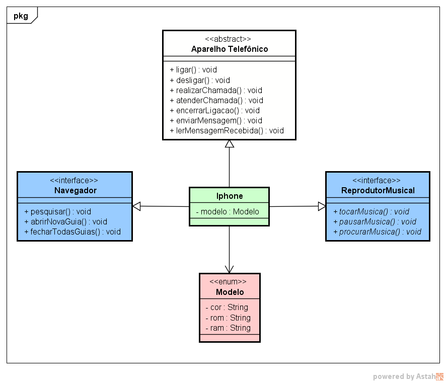

# Diagramação_Iphone

Desafio de Projeto da DIO - Santander Bootcamp 2023 - Backend Java

O desafio consiste em criar classes e interfaces baseado no que foi aprendido em relação a Orientação a Objetos. O projeto consiste em uma diagramação simples do smartphone da Apple, o Iphone.

O Iphone que teve suas origens em meados de 2007, revolucionou o mercado de celulares quando, o mesmo que fora apresentado iria ser mais que um celular comum, mas, um celular multifuncional, com navegador web, player de música, acesso a diversos aplicativos e as demais operações básicas de um celular comum.

Tendo isto em mente, foi desenvolvido uma simples representação em UML e em código java, como podemos ver na imagem abaixo:

O código implementado se encontra [aqui](src/main/java/).
